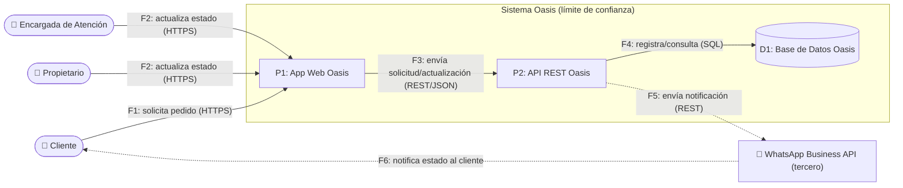

# 📄 Informe Técnico del Taller

## 🔖 Nombre del Taller
Taller 5 - Evaluación de Seguridad con STRIDE

## 👥 Integrantes del equipo
- Esteban Díaz Vargas
- Katherin Juliana Moreno Carvajal

## 🧠 Descripción general del trabajo
El objetivo de esta Parte 2 fue aplicar el marco STRIDE sobre un proceso crítico del sistema real del cliente — **Oasis Atelier Floral** — siguiendo los mismos 5 pasos de la metodología usada en clase sobre el flujo de pagos de EdukIT: dibujar el DFD, identificar los elementos, aplicar las 6 categorías STRIDE, evaluar impacto y mitigación, y priorizar por riesgo.

Se eligió el flujo de **"Solicitud de pedido y notificación automática de estado"**, el paralelo más directo del flujo trabajado en clase: ambos cruzan el límite de confianza hacia un servicio de terceros (la pasarela de pago en EdukIT, WhatsApp Business API en Oasis) y ambos dependen de que el backend no confíe ciegamente en la confirmación reportada por ese tercero.

## 🔧 Proceso de desarrollo

**Paso 1-2 — DFD y elementos**: se retomaron los actores y contenedores ya definidos en los Talleres 3 y 4 (Cliente, Propietario, Encargada de Atención, App Web Oasis, API REST Oasis, Base de Datos Oasis, WhatsApp Business API), y se dibujó el DFD del flujo de solicitud de pedido con el límite de confianza alrededor de App Web + API REST + Base de Datos.

**Paso 3-4 — STRIDE, impacto y mitigación**: se aplicaron las 6 categorías, formulando cada amenaza sobre un elemento específico del diagrama.

**Reconocimiento pasivo (sección 5 de la guía) — nota metodológica importante**: a diferencia de EdukIT, Oasis **no tiene hoy ningún sistema desplegado** (opera 100% por Instagram y WhatsApp manual); el "Sistema Oasis" documentado en los Talleres 3 y 4 es la arquitectura objetivo aún no construida. Esto significa que las técnicas de reconocimiento pasivo de la guía (`curl -I`, SSL Labs, Swagger expuesto) **no tienen un sistema real sobre el cual aplicarse todavía**. Se optó por la alternativa metodológica más honesta: la columna "Controles de Seguridad Existentes" se completó con los **controles ya definidos en el diseño de la arquitectura objetivo** (Talleres 3-4), marcados explícitamente como "Ninguno definido" cuando el diseño actual no contempla ningún control frente a esa amenaza — en lugar de inventar hallazgos de reconocimiento sobre un sistema que no existe. Este es un supuesto que vale la pena confirmar contigo antes de la entrega final.

**Paso 5 — Priorización**: la tabla quedó ordenada de mayor a menor riesgo: T4 (Alto) → T1, T5 (Medio) → T2, T3, T6 (Bajo).

## 🧩 Análisis del modelo propuesto

### Cómo se estructura el modelo
Un actor externo principal (Cliente) más dos actores internos de confianza (Propietario, Encargada), un backend de dos procesos + un almacén, y un único sistema de terceros (WhatsApp Business API) — la misma proporción de complejidad que ya se definió en los Talleres 3 y 4 para esta arquitectura monolítica de bajo costo.

### Cómo representa las necesidades del cliente
La amenaza de mayor riesgo (T4, Information Disclosure) no es casualidad: conecta directamente con dos hallazgos previos del proyecto — el riesgo de infraestructura de bajo costo sin cifrado ya diagnosticado en el Taller 4, y la naturaleza de los datos que maneja Oasis (nombre, teléfono, dirección de clientes reales, no datos de prueba). Priorizarlo como el riesgo más alto es consistente con que Oasis es una empresa colombiana sujeta a la Ley 1581 de 2012 desde el día en que tenga una base de datos de clientes, sin importar su tamaño.

### Diferencias explícitas con el caso base (EdukIT)

| Aspecto | EdukIT (caso base) | Oasis (cliente real) |
|---|---|---|
| Riesgo de mayor prioridad | Elevation of Privilege (confiar en la confirmación de pago del cliente) | Information Disclosure (exposición de datos personales por falta de cifrado/control de acceso) |
| Origen del riesgo principal | Antipatrón de diseño en un sistema ya complejo con pagos reales | Limitación de una infraestructura de bajo costo sin presupuesto para cifrado o auditoría |
| Reconocimiento pasivo (sección 5) | Aplicable — EdukIT es un sistema en producción | No aplicable todavía — Oasis no tiene sistema desplegado; se usan controles de diseño documentados en su lugar |
| Marco regulatorio relevante | PCI DSS (datos de tarjeta de pago) | Ley 1581 de 2012 / Habeas Data (datos personales de clientes) |
| Perfil de riesgo general | Concentrado en Alto (3 de 6 amenazas) | Más distribuido (1 Alto, 2 Medio, 3 Bajo) — reflejo de una superficie de ataque menor y de un equipo de solo 2 personas de confianza |

### Supuestos tomados
- Se asumió que el flujo de "Solicitud de pedido y notificación automática" es el proceso crítico más representativo de Oasis, por ser el único que cruza el límite de confianza hacia un tercero (WhatsApp Business API), igual que el flujo de pagos de EdukIT.
- Se asumió que, al no existir un sistema desplegado, los "Controles de Seguridad Existentes" documentan el diseño ya definido en los Talleres 3-4, no observación real — ver nota metodológica arriba.
- Se asumió que el pago (Nequi/Daviplata) permanece fuera del sistema (verificación manual), consistente con los supuestos ya declarados en el Taller 3, por lo que no se analiza como parte de este DFD.

## 📈 Diagrama final entregado

Toda conexión que cruza el límite de confianza (F1, F2, F5, F6) es un punto de análisis obligatorio.

## 📋 Tabla de actores, entidades o componentes

| Nombre del elemento | Tipo | Descripción | Responsable |
|---|---|---|---|
| Cliente | Actor externo | Solicita un pedido y recibe notificaciones de estado | Cliente |
| Propietario / Encargada de Atención | Actor interno | Actualizan el estado del pedido desde el panel | Equipo Oasis |
| App Web Oasis (P1) | Proceso | Interfaz de acceso al sistema | Equipo Oasis |
| API REST Oasis (P2) | Proceso | Gestiona solicitudes, estados y notificaciones | Equipo Oasis |
| Base de Datos Oasis (D1) | Almacén de datos | Registra clientes, solicitudes y pedidos | Equipo Oasis |
| WhatsApp Business API | Sistema externo / tercero | Envía notificaciones automáticas de estado | Proveedor externo (Meta) |

## 🔍 Investigación complementaria

### Tema investigado:
Marco legal de protección de datos personales en Colombia aplicable a pequeñas empresas, y buenas prácticas de seguridad para integraciones con WhatsApp Business API.

### Resumen:
La Ley 1581 de 2012 (Habeas Data) aplica a cualquier organización que recolecte, almacene o use datos de personas naturales en Colombia, **sin importar su tamaño ni su sector** — el solo hecho de que Oasis tenga una base de datos de clientes con nombre, teléfono y dirección la convierte en responsable del tratamiento ante la Superintendencia de Industria y Comercio, con obligaciones concretas de seguridad y de atención de derechos del titular (conocer, actualizar, rectificar y solicitar supresión de sus datos). Esto respalda directamente por qué T4 (Information Disclosure sobre la Base de Datos Oasis) se prioriza como el riesgo más alto de la tabla: no es solo un riesgo técnico, es una obligación legal desde el primer cliente registrado.

Sobre la integración con WhatsApp Business API, la documentación técnica de seguridad de la plataforma recomienda validar la autenticidad de cada webhook entrante mediante la firma `X-Hub-Signature-256` (HMAC-SHA256) antes de procesarlo, en lugar de confiar en la sola procedencia de la solicitud. Aunque el flujo de Oasis solo contempla notificaciones salientes (API → WhatsApp) en esta fase, este control se vuelve directamente relevante en cuanto se agregue cualquier funcionalidad que reciba confirmaciones desde WhatsApp hacia la API, y es consistente con el mismo principio de "nunca confiar en el resultado reportado por el cliente" identificado en el análisis del caso base EdukIT (T6).

## 📚 Referencias

Las referencias utilizadas y la información de investigación complementaria se encuentran registradas en `referencias.md`.

---

_Este documento hace parte de la entrega del Taller 5 del curso AREM (Arquitectura Empresarial) - Universidad de La Sabana._
